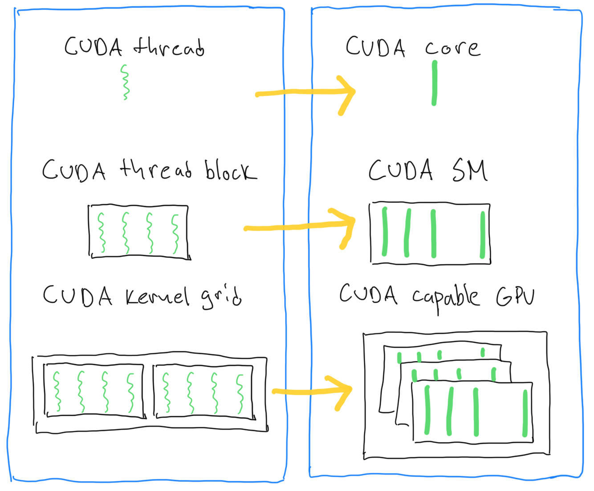
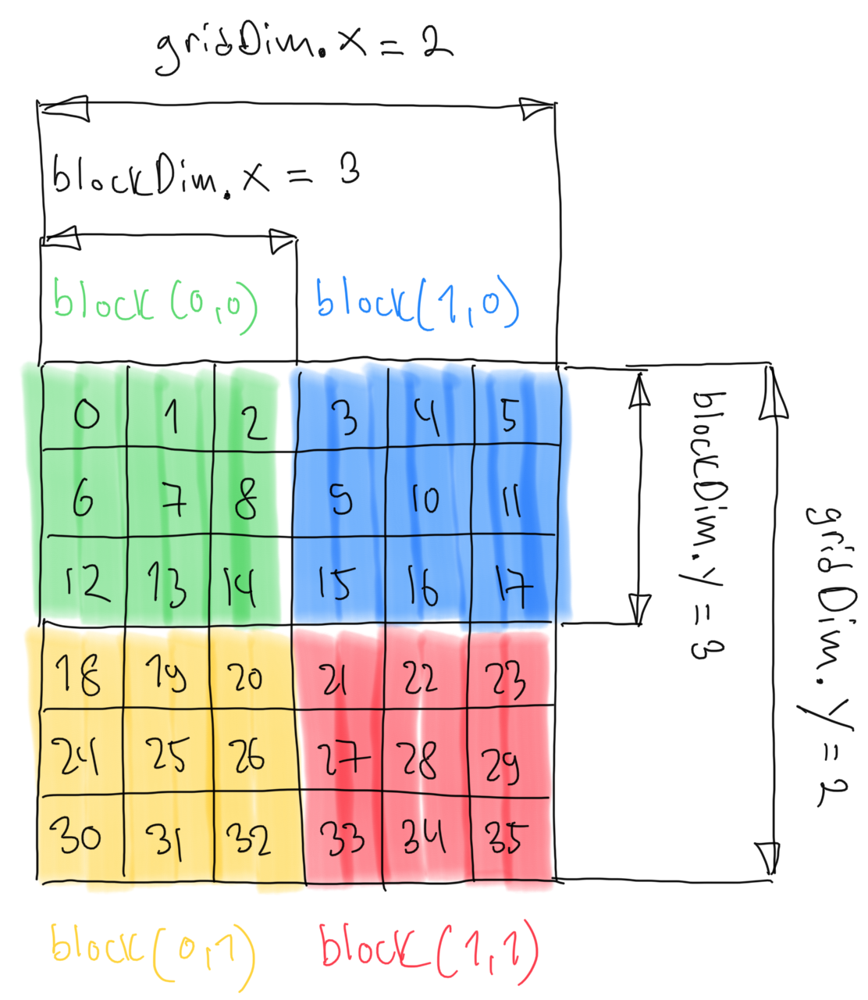

# CUDA Examples

This repository contains an explanation of the CUDA programming model and some examples demonstrating CUDA programming.
CMake is used to build the examples.

# CUDA Programming Model

The CUDA programming model provides an abstraction of the GPU architecture and acts as a bridge between an application
and the implementation on GPU hardware. The system consists of:

* the host (CPU)
* the device(s) (GPU)

Execution of the CUDA programming consists of three steps:
1. Copy input data from the host to the device memory (host-to-device transfer)
2. Load the GPU program and execute it
3. Copy the results from the device back to the host memory (device-to-host transfer)

CUDA programming model consists of threads, blocks and grids. Several threads are grouped together into blocks and
several blocks are grouped together into grids. Each CUDA block is executed by one streaming multiprocessor (SM)
and cannot be migrated to other SMs in GPU. One SM can run several concurrent CUDA blocks depending on the resources needed
by the CUDA blocks.

# Mapping of 2D Data to a GPU

CUDA defines built-in variables that define number of threads, blocks and grids. Using these variables a vector (an array), a matrix (2D) or
a volume of matrices (3D) can be mapped to the GPU.

## Mapping of 2D Data to a GPU 

# Examples

* [CUDA thread organization and element access](./cuda_thread_organization/README.md)

